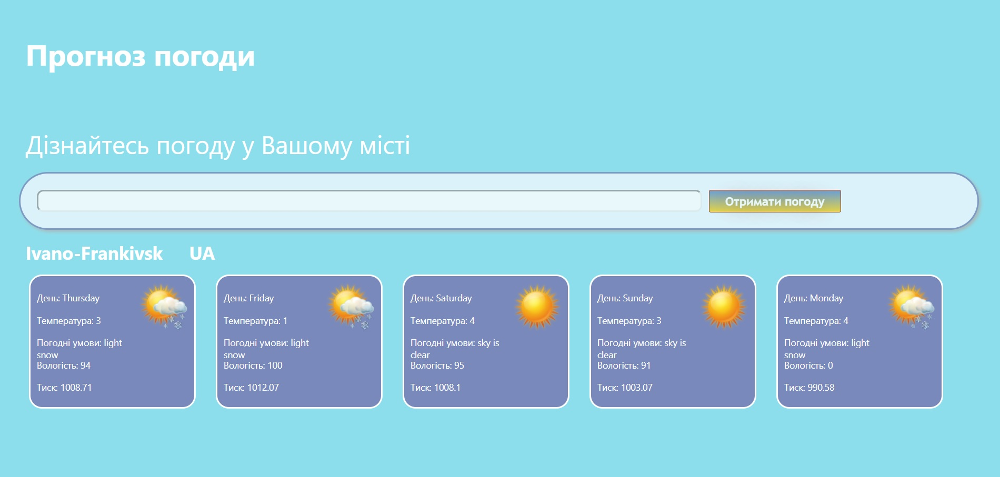

# Weather-React-Redux

Technologies, elements and libraries used when writing an application:
HTML, CSS, JavaScript, React, Redux

This app for getting weather by your city

## View
<table align="left" width="100%">
  <tbody>
    <tr>
      <td colspan="1">  </td>
  </tbody>
</table>

## Version
0.01

## How to install
In the project directory, you can run:
### `npm start`

Runs the app in the development mode. 
Open [http://localhost:3000](http://localhost:3000) to view it in the browser.
